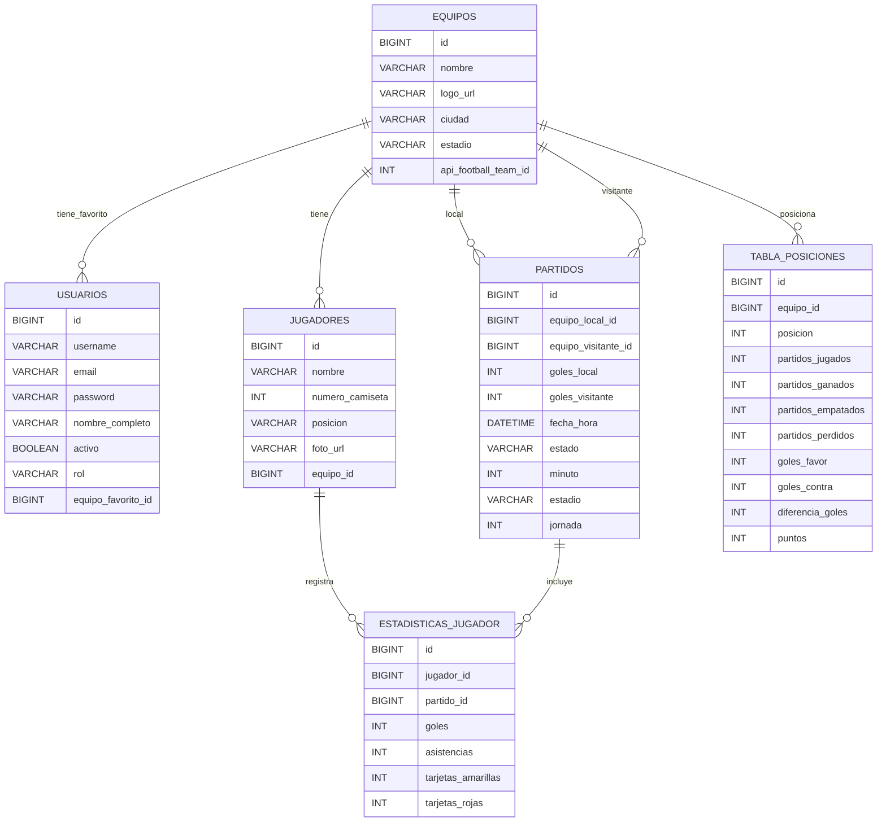

# Liga1 Pro - Aplicación de Fútbol

Aplicación full-stack para seguir los partidos de la Liga 1 Peruana en tiempo real.

## Estructura del Proyecto

```
Liga1_Pro/
├── backend-spring-KEVIN/      # Backend Spring Boot
│   ├── src/
│   │   ├── main/java/com/example/liga1pro/
│   │   │   ├── controller/     # REST Controllers
│   │   │   ├── service/        # Lógica de negocio
│   │   │   ├── repository/     # Acceso a datos
│   │   │   ├── model/          # Entidades JPA
│   │   │   ├── dto/            # Data Transfer Objects
│   │   │   ├── config/         # Configuración
│   │   │   └── security/       # Seguridad y JWT
│   │   └── resources/
│   │       └── application.properties
│   └── pom.xml
│
└── frontend-web-RONY/          # Frontend React + Vite
    ├── src/
    │   ├── components/         # Componentes React
    │   ├── pages/             # Páginas
    │   ├── services/          # Servicios API
    │   ├── styles/            # Estilos CSS
    │   ├── App.jsx
    │   └── main.jsx
    ├── package.json
    └── vite.config.js
```

## Backend - Spring Boot

### Requisitos
- Java 17+
- Maven 3.8+
- MySQL 8.0+

### Configuración de Base de Datos

Editar `src/main/resources/application.properties`:

```properties
spring.datasource.url=jdbc:mysql://localhost:3306/liga1_pro
spring.datasource.username=root
spring.datasource.password=tu_contraseña
spring.jpa.hibernate.ddl-auto=update
```

### Ejecutar el Backend

```bash
cd backend-spring-KEVIN
./mvnw clean install
./mvnw spring-boot:run
```

El servidor estará disponible en `http://localhost:8080`

### Endpoints Principales

- `GET /api/partidos/en-vivo` - Obtener partidos en vivo
- `GET /api/partidos/jornada/{jornada}` - Partidos de una jornada
- `GET /api/equipos` - Todos los equipos
- `GET /api/tabla-posiciones` - Tabla de posiciones
- `GET /api/estadisticas/partido/{id}` - Estadísticas de un partido

## Frontend - React + Vite

### Requisitos
- Node.js 16+
- npm o yarn

### Instalación

```bash
cd frontend-web-RONY
npm install
```

### Ejecutar el Desarrollo

```bash
npm run dev
```

La aplicación estará disponible en `http://localhost:5173`

### Build para Producción

```bash
npm run build
```

## Características Implementadas

### Página de Inicio
- ✅ Navbar con navegación
- ✅ Vista de partidos en vivo
- ✅ Información de equipos y resultados
- ✅ Diseño responsive
- ✅ Tema oscuro (Liga1 Pro)

### Por Implementar
- 📋 Tabla de posiciones
- 📅 Fixture completa
- 📊 Estadísticas de jugadores
- 👥 Detalles de clubes
- 📰 Noticias
- 🔐 Sistema de autenticación

## Estilos y Colores

- Color primario: `#cc0000` (Rojo)
- Fondo: `#0a0a0a` (Negro profundo)
- Texto: `#ffffff` (Blanco)
- Acentos: `#1a1a1a` (Gris oscuro)

## API CORS

El backend está configurado con CORS habilitado para desarrollo:
- Origen: `*`
- Métodos: `GET`, `POST`, `PUT`, `DELETE`
- Headers: `*`

## Notas Importantes

1. **Base de Datos**: Se debe crear manualmente o usar las migraciones automáticas de Hibernate
2. **JWT**: Configurar claves secretas en variables de entorno
3. **CORS**: Restringir a dominios específicos en producción
4. **API URL**: Cambiar en `src/services/api.js` según entorno

## Troubleshooting

### Maven wrapper no funciona
```bash
# Ejecutar desde el directorio del backend
./mvnw --version
```

### Frontend no se conecta al backend
- Verificar que el backend esté corriendo en puerto 8080
- Verificar CORS está habilitado
- Revisar la consola del navegador para errores

### Base de datos
```sql
CREATE DATABASE liga1_pro;
USE liga1_pro;
```

## Licencia

Proyecto educativo - Liga1 Pro

## Autores

- Backend: Kevin
- Frontend: Rony
- Backend: Mauricio

## Diagrama Entidad-Relacion (ERD)

GitHub renderiza este bloque automaticamente:


